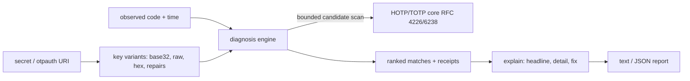

# totpdoctor

[English](README.md) | [中文](README.zh.md) | [日本語](README.ja.md)

[](LICENSE) [](CHANGELOG.md) [](pyproject.toml)  [](CONTRIBUTING.md)

**オープンソースの 2FA デバッガー。TOTP / HOTP コードが*なぜ*一致しないのか——時計のずれ、桁数、アルゴリズム、壊れた base32 シークレット——を説明する。もう一つコードを生成するだけのツールではない。**


```bash
git clone https://github.com/JaydenCJ/totpdoctor && cd totpdoctor && pip install -e .
```

> **プレリリース：** totpdoctor はまだ PyPI に公開されていません。初回リリースまでは [JaydenCJ/totpdoctor](https://github.com/JaydenCJ/totpdoctor) をクローンし、リポジトリのルートで `pip install -e .` を実行してください。

## なぜ totpdoctor？

2FA 連携が失敗したとき、手元のどのツールも間違った問いに答えます。`oathtool` や `pyotp` は*自分が*計算したコードを表示するだけ——ユーザーのコードと違っていたら、あとは手作業の二分探索です：スマホの時計が遅れている？サーバーは SHA256 で登録したのにアプリは SHA1 で生成している？クライアントがデコード後の鍵ではなく base32 の*文字列*そのものを HMAC している？`O` を `0` と書き写した？totpdoctor はワークフローを逆転させます：シークレット、失敗したコード、失敗した時刻を渡せば、単一障害の仮説空間——ずれ、アルゴリズム、桁数、周期、シークレットのデコード、HOTP/TOTP の取り違え、カウンタの不同期、先頭ゼロの欠落——を探索し、観測されたコードを再現する偏差を最も単純なものから順に報告し、候補数と偶然衝突の確率という証拠を添えます。

|  | totpdoctor | oathtool | pyotp | otplib |
|---|---|---|---|---|
| コードが一致しない理由を説明 | はい、仮説をランク付け | いいえ（生成のみ） | いいえ（生成/検証） | いいえ（生成/検証） |
| 大きさ付きの時計ずれ検出 | はい、符号付き秒数 | 手作業の二分探索 | `valid_window` は許容のみ、報告しない | `window` は許容のみ、報告しない |
| 誤ったアルゴリズム / 桁数 / 周期の探索 | はい、自動 | 推測ごとに 1 回実行 | 推測ごとに 1 回呼び出し | 推測ごとに 1 回呼び出し |
| base32 シークレットの検査 + 修復提案 | はい（`0→O`、`1→I/L`、hex 検出） | いいえ | いいえ | いいえ |
| otpauth:// URI の相互運用性監査 | はい、アプリの落とし穴を警告 | いいえ | パースのみ | パースのみ |
| マッチの信頼度の証拠 | 試行候補数 + 衝突リスク | — | — | — |
| ランタイム依存 | 0 | C ツールチェーン + liboath | 0 | 0 |

<sub>依存数は 2026-07 時点で各プロジェクトが宣言するランタイム要件：pyotp 2.9（0）、otplib 12.x（3 パッケージ合計 0）、oathtool は oath-toolkit の C バイナリ。totpdoctor の数は [pyproject.toml](pyproject.toml) の `dependencies = []` です。</sub>

## 特徴

- **9 つの障害クラスを 1 コマンドで** —— 時計のずれ、アルゴリズム誤り、桁数誤り、周期誤り、raw-ASCII/hex/base32hex のシークレット誤用、見間違え文字の写し間違い、HOTP↔TOTP モードの取り違え、カウンタ不同期、整数化で消えた先頭ゼロ。
- **最も単純な説明を最初に** —— マッチは偏差の数、次に障害のありふれ度（ずれ＞アルゴリズム＞モード）、最後に大きさで並ぶため、遅れたスマホの時計が奇妙な偶然に埋もれることはありません。
- **感覚ではなく証拠** —— すべてのレポートに、試行した候補数と、マッチが 1/10^桁数 のまぐれ当たりである確率（デフォルト実行で約 0.01%）を明記。ウィンドウ規律がこの数字を小さく保ちます。
- **修復付きシークレット検査** —— `totpdoctor secret` は区切り文字、大小文字、パディング、切り詰め、hex らしきシークレット、RFC 4226 の最小長未満の鍵を指摘し、OCR/手書きの見間違え文字にデコード可能な修復候補を提案します。
- **otpauth:// URI 監査** —— 登録 URI をパースし、主要な認証アプリが黙って無視するパラメータ（SHA1 以外のアルゴリズム、8 桁、30 秒以外の周期）をチケット化する前に警告します。
- **決定的かつ完全オフライン** —— RFC 4226/6238 コアは公式付録のテストベクタで検証済み；`--at` で時計を固定して再現可能なレポート；ランタイム依存ゼロ、ネットワークには一切出ません。

## クイックスタート

インストール：

```bash
git clone https://github.com/JaydenCJ/totpdoctor && cd totpdoctor && pip install -e .
```

ユーザーからコード `314370` が拒否されたと報告があった。totpdoctor に理由を聞く：

```bash
totpdoctor diagnose --secret JBSWY3DPEHPK3PXP --code 314370 --at 2026-07-12T12:00:00Z
```

```text
observed 314370 | expected TOTP SHA1, 6 digits, 30s period | at 2026-07-12 12:00:00Z

verdict: MATCH — 1 explanation found (147 candidates tested, chance-collision risk 0.01%)

  1. clock skew: -90 s (-3 steps)
     The code is valid for 2026-07-12 11:58:30Z - 2026-07-12 11:59:00Z, i.e.
     the generating device's clock is about 90 seconds behind the verifier's.
     fix: Sync the generating device's clock via NTP; if skew persists, widen
     the server's accepted window or investigate the device's timezone/DST
     handling.
```

終了コード 0 は説明が見つかったこと、1 は仮説空間のどれもコードを再現しないこと、2 は入力自体が壊れていることを意味します。`--json` で機械可読レポートになります。

「たまにしか通らない」シークレットを検査する：

```bash
totpdoctor secret 'jbsw 0ehk'
```

```text
normalized: JBSW0EHK
decodes: no
issue [separators]: secret contains spaces or dashes (common when pasted in groups)
  hint: totpdoctor removed them; store the secret without separators
issue [lowercase]: secret contains lowercase letters; the RFC 4648 alphabet is uppercase
  hint: most decoders fold case, but strict ones reject it — store uppercase
issue [non-alphabet]: character '0' is not in the base32 alphabet (A-Z, 2-7)
  hint: did you mean 'O'?
repair candidate: JBSWOEHK
```

全障害クラスを順に実演するスクリプトは [`examples/`](examples/) に、探索そのもの——仮説空間、ウィンドウ規律、ランク付け、誤検出の数学——の仕様は [`docs/diagnosis.md`](docs/diagnosis.md) にあります。

## 診断仮説

| 偏差 | 検出条件 | 典型的な修正 |
|---|---|---|
| `skew` | ずらした TOTP ステップでコードが一致（デフォルト ±40 ステップ） | デバイスの時計を同期；サーバー側で ±1 ステップ許容 |
| `algorithm` | SHA1 でなく SHA256/SHA512 で一致（またはその逆） | アルゴリズムを揃える；URI の値を無視するアプリも多い |
| `digits` | 観測された長さが別の桁数設定に対応 | 桁数を揃える；相互運用のデフォルトは 6 |
| `period` | 30 秒でなく 15 秒や 60 秒のステップで一致 | 周期を揃える；30 秒固定のアプリもある |
| `secret` | raw-ASCII / hex / base32hex / 修復後の鍵バイトで一致 | クライアントのデコードか保存シークレットを修正 |
| `mode` | TOTP 期待なのに HOTP 値、またはその逆 | 登録レコードの otpauth タイプを確認 |
| `counter` | 不同期のカウンタで HOTP コードが一致（デフォルト先読み 64） | RFC 4226 §7.4 に従い再同期 |
| `format` | 先頭ゼロを落とした完全なコードが観測値と等しい | コードは常に文字列で扱い、比較時にゼロ埋め |

## CLI リファレンス

| フラグ | デフォルト | 効果 |
|---|---|---|
| `--secret` / `--uri` | — | 共有シークレット、またはシークレットとパラメータを運ぶ otpauth:// URI |
| `--code` | — | 説明対象の観測コード（`diagnose` のみ） |
| `--at` | 現在時刻 | 基準時刻：Unix 秒または ISO 8601（`2026-07-12T12:00:00Z`） |
| `--algorithm` / `--digits` / `--period` | SHA1 / 6 / 30 | 検証側が信じる値；フラグは `--uri` の値を上書き |
| `--counter` | — | HOTP モードに切り替え、期待カウンタを指定 |
| `--max-skew` | 40 | ずれスキャン幅（ステップ）、各方向 |
| `--hotp-scan` | 16 | HOTP 登録仮説で試すカウンタ数 |
| `--look-ahead` | 64 | HOTP モード：期待カウンタより先をスキャンする数 |
| `--window` | 1 | `gen` のみ：現在ステップの両側（TOTP）またはカウンタ以降（HOTP）に追加表示するコード数 |
| `--json` | オフ | 全サブコマンドで機械可読出力 |

サブコマンド：`diagnose`（不一致の説明）、`gen`（文脈付き生成：前/現在/次と有効ウィンドウ）、`secret`（検査 + 修復）、`uri`（パース + 相互運用監査）。

## 検証

このリポジトリは CI を持ちません；上記の主張はすべてローカル実行で検証されています。このリポジトリのチェックアウトから再現できます：

```bash
pip install -e '.[dev]' && pytest && bash scripts/smoke.sh
```

出力（実際の実行からコピー、`...` で省略）：

```text
92 passed in 0.13s
...
[secret] repair candidate: JBSWOEHK
SMOKE OK
```

## アーキテクチャ



## ロードマップ

- [x] 診断エンジン（9 障害クラス）、証拠付きランク説明、シークレット検査 + 修復、otpauth 監査、gen/diagnose/secret/uri CLI、JSON 出力（v0.1.0）
- [ ] PyPI へ公開し `pip install totpdoctor` に対応
- [ ] Steam Guard などの非標準 5 桁/英数字アルファベット
- [ ] `--pair` モード：連続する 2 つのコードからずれを正確に特定
- [ ] ログイン失敗時に診断を返す検証側ライブラリ API

全リストは [open issues](https://github.com/JaydenCJ/totpdoctor/issues) を参照してください。

## コントリビュート

コントリビュート歓迎です——まずは [good first issue](https://github.com/JaydenCJ/totpdoctor/issues?q=is%3Aissue+is%3Aopen+label%3A%22good+first+issue%22) から、あるいは [discussion](https://github.com/JaydenCJ/totpdoctor/discussions) を立ててください。開発環境は [CONTRIBUTING.md](CONTRIBUTING.md) を参照。

## ライセンス

[MIT](LICENSE)
