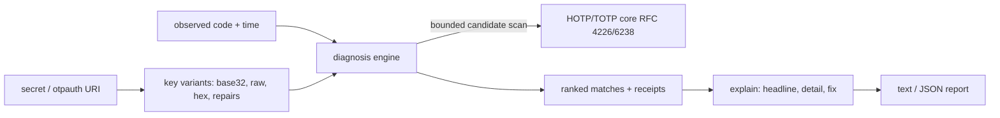

# totpdoctor

[English](README.md) | [中文](README.zh.md) | [日本語](README.ja.md)

[](LICENSE) [](CHANGELOG.md) [](pyproject.toml)  [](CONTRIBUTING.md)

**Open-source 2FA debugger that explains *why* a TOTP or HOTP code mismatches — clock skew, digits, algorithm, or a mangled base32 secret — instead of just generating another code.**


```bash
git clone https://github.com/JaydenCJ/totpdoctor && cd totpdoctor && pip install -e .
```

> **Pre-release:** totpdoctor is not yet published to PyPI. Until the first release, clone [JaydenCJ/totpdoctor](https://github.com/JaydenCJ/totpdoctor) and run `pip install -e .` from the repository root.

## Why totpdoctor?

When a 2FA integration fails, every tool you reach for answers the wrong question. `oathtool` and `pyotp` will happily print the code *they* compute — and when it differs from the user's, you are left bisecting by hand: is the phone's clock slow? Did the server enroll SHA256 while the app generates SHA1? Is the client HMAC-ing the base32 *string* instead of the decoded key? Was a `0` transcribed for an `O`? totpdoctor inverts the workflow: give it the secret, the code that failed, and the moment it failed, and it searches the single-fault hypothesis space — skew, algorithm, digits, period, secret decoding, HOTP/TOTP confusion, counter desync, stripped zeros — and reports which deviation reproduces the observed code, ranked simplest-first, with the candidate count and chance-collision probability as receipts.

|  | totpdoctor | oathtool | pyotp | otplib |
|---|---|---|---|---|
| Explains why a code mismatches | Yes, ranked hypotheses | No (generates only) | No (generates/verifies) | No (generates/verifies) |
| Clock-skew detection with magnitude | Yes, signed seconds | Manual bisection | `valid_window` accepts, never reports | `window` accepts, never reports |
| Wrong algorithm / digits / period search | Yes, automatic | One run per guess | One call per guess | One call per guess |
| base32 secret linting + repair suggestions | Yes (`0→O`, `1→I/L`, hex detection) | No | No | No |
| otpauth:// URI interoperability audit | Yes, app-pitfall warnings | No | Parse only | Parse only |
| Match-confidence receipts | Candidates tested + collision risk | — | — | — |
| Runtime dependencies | 0 | C toolchain + liboath | 0 | 0 |

<sub>Dependency counts are the declared runtime requirements as of 2026-07: pyotp 2.9 (0), otplib 12.x (0 across its three packages), oathtool is a C binary from oath-toolkit. totpdoctor's count is `dependencies = []` in [pyproject.toml](pyproject.toml).</sub>

## Features

- **Nine fault classes, one command** — clock skew, wrong algorithm, wrong digits, wrong period, raw-ASCII/hex/base32hex secret misuse, look-alike-character typos, HOTP↔TOTP mode confusion, counter desync, and integer-stripped leading zeros.
- **Simplest explanation first** — matches are ranked by deviation count, then by how ordinary the failure is (skew before algorithm before mode), then by magnitude, so a slow phone clock never hides behind an exotic coincidence.
- **Receipts, not vibes** — every report states how many candidates were tested and the probability that a match is a 1-in-10^digits fluke (≈0.01% for a default run), with a window discipline that keeps that number small.
- **Secret lint with repairs** — `totpdoctor secret` flags separators, case, padding, truncation, hex-like secrets, and RFC 4226-short keys, and proposes decodable repairs for OCR/typing confusables.
- **otpauth:// URI audit** — parses enrollment URIs and warns about the parameters popular authenticator apps silently ignore (non-SHA1 algorithms, 8 digits, non-30 s periods) before they become tickets.
- **Deterministic and offline** — RFC 4226/6238 cores verified against the published appendix vectors; `--at` pins the clock for reproducible reports; zero runtime dependencies, no network, ever.

## Quickstart

Install:

```bash
git clone https://github.com/JaydenCJ/totpdoctor && cd totpdoctor && pip install -e .
```

A user reports that code `314370` was rejected. Ask totpdoctor why:

```bash
totpdoctor diagnose --secret JBSWY3DPEHPK3PXP --code 314370 --at 2026-07-12T12:00:00Z
```

```text
observed 314370 | expected TOTP SHA1, 6 digits, 30s period | at 2026-07-12 12:00:00Z

verdict: MATCH — 1 explanation found (147 candidates tested, chance-collision risk 0.01%)

  1. clock skew: -90 s (-3 steps)
     The code is valid for 2026-07-12 11:58:30Z - 2026-07-12 11:59:00Z, i.e.
     the generating device's clock is about 90 seconds behind the verifier's.
     fix: Sync the generating device's clock via NTP; if skew persists, widen
     the server's accepted window or investigate the device's timezone/DST
     handling.
```

Exit code 0 means an explanation was found; 1 means nothing in the hypothesis space reproduces the code; 2 means the input itself is broken. Add `--json` for a machine-readable report.

Lint a secret that "sometimes works":

```bash
totpdoctor secret 'jbsw 0ehk'
```

```text
normalized: JBSW0EHK
decodes: no
issue [separators]: secret contains spaces or dashes (common when pasted in groups)
  hint: totpdoctor removed them; store the secret without separators
issue [lowercase]: secret contains lowercase letters; the RFC 4648 alphabet is uppercase
  hint: most decoders fold case, but strict ones reject it — store uppercase
issue [non-alphabet]: character '0' is not in the base32 alphabet (A-Z, 2-7)
  hint: did you mean 'O'?
repair candidate: JBSWOEHK
```

A staged walkthrough of every fault class lives in [`examples/`](examples/), and the search itself — hypothesis space, window discipline, ranking, false-positive math — is specified in [`docs/diagnosis.md`](docs/diagnosis.md).

## Diagnosis hypotheses

| Deviation | Detected when | Typical fix |
|---|---|---|
| `skew` | Code matches at a shifted TOTP step (±40 steps by default) | Sync the device clock; accept ±1 step server-side |
| `algorithm` | Code matches under SHA256/SHA512 instead of SHA1 (or vice versa) | Align the algorithm; many apps ignore the URI's value |
| `digits` | Observed length matches a different digit configuration | Align digits; 6 is the interoperable default |
| `period` | Code matches with 15 s or 60 s steps instead of 30 s | Align period; some apps hard-code 30 s |
| `secret` | Code matches raw-ASCII / hex / base32hex / repaired key bytes | Fix the client's decoding or the stored secret |
| `mode` | Code is an HOTP value though TOTP was expected, or vice versa | Check the enrollment record's otpauth type |
| `counter` | HOTP code matches at a desynced counter (default look-ahead 64) | Resync per RFC 4226 §7.4 |
| `format` | Full code with leading zeros stripped equals the observation | Treat codes as strings, zero-pad on compare |

## CLI reference

| Flag | Default | Effect |
|---|---|---|
| `--secret` / `--uri` | — | Shared secret, or an otpauth:// URI carrying secret and parameters |
| `--code` | — | The observed code to explain (`diagnose` only) |
| `--at` | now | Reference time: Unix seconds or ISO 8601 (`2026-07-12T12:00:00Z`) |
| `--algorithm` / `--digits` / `--period` | SHA1 / 6 / 30 | What the verifier believes; flags override `--uri` values |
| `--counter` | — | Switches to HOTP mode with this expected counter |
| `--max-skew` | 40 | Skew scan width in steps, each direction |
| `--hotp-scan` | 16 | Counters tried for the HOTP-enrollment hypothesis |
| `--look-ahead` | 64 | HOTP mode: counters scanned ahead of the expected one |
| `--window` | 1 | `gen` only: extra codes each side of the current step (TOTP) or after the counter (HOTP) |
| `--json` | off | Machine-readable output for every subcommand |

Subcommands: `diagnose` (explain a mismatch), `gen` (codes with context: previous/current/next and validity windows), `secret` (lint + repairs), `uri` (parse + interop audit).

## Verification

This repository ships no CI; every claim above is verified by local runs. Reproduce them from a checkout of this repository:

```bash
pip install -e '.[dev]' && pytest && bash scripts/smoke.sh
```

Output (copied from a real run, truncated with `...`):

```text
92 passed in 0.13s
...
[secret] repair candidate: JBSWOEHK
SMOKE OK
```

## Architecture



## Roadmap

- [x] Diagnosis engine (9 fault classes), ranked explanations with receipts, secret lint + repairs, otpauth audit, gen/diagnose/secret/uri CLI, JSON output (v0.1.0)
- [ ] PyPI release with `pip install totpdoctor`
- [ ] Steam Guard and other non-standard 5-digit/alphanumeric alphabets
- [ ] `--pair` mode: diagnose from two consecutive codes to pin skew exactly
- [ ] Verifier-side library API returning the diagnosis for failed logins

See the [open issues](https://github.com/JaydenCJ/totpdoctor/issues) for the full list.

## Contributing

Contributions are welcome — start with a [good first issue](https://github.com/JaydenCJ/totpdoctor/issues?q=is%3Aissue+is%3Aopen+label%3A%22good+first+issue%22) or open a [discussion](https://github.com/JaydenCJ/totpdoctor/discussions). See [CONTRIBUTING.md](CONTRIBUTING.md) for the development setup.

## License

[MIT](LICENSE)
