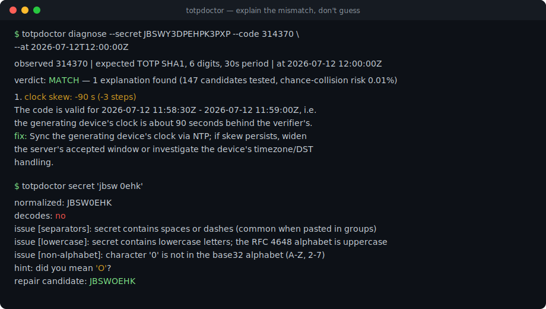
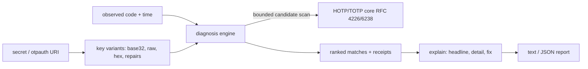

# totpdoctor

[English](README.md) | [中文](README.zh.md) | [日本語](README.ja.md)

[](LICENSE) [](CHANGELOG.md) [](pyproject.toml)  [](CONTRIBUTING.md)

**开源 2FA 调试器：解释 TOTP / HOTP 验证码*为什么*对不上——时钟偏移、位数、算法、还是 base32 密钥被弄坏了——而不是再给你生成一个验证码。**



```bash
git clone https://github.com/JaydenCJ/totpdoctor && cd totpdoctor && pip install -e .
```

> **预发布：** totpdoctor 尚未发布到 PyPI。在首个正式版之前，请克隆 [JaydenCJ/totpdoctor](https://github.com/JaydenCJ/totpdoctor) 并在仓库根目录运行 `pip install -e .`。

## 为什么选 totpdoctor？

2FA 集成一旦出问题，你手边的每个工具回答的都是错误的问题。`oathtool` 和 `pyotp` 只会打印*它们*算出来的验证码——当它和用户手里的不一样时，你只能手工二分排查：手机时钟慢了？服务器登记的是 SHA256 而 app 生成的是 SHA1？客户端把 base32 *字符串*本身拿去做 HMAC 而不是解码后的密钥？还是有人把 `O` 抄成了 `0`？totpdoctor 把流程反过来：给它密钥、失败的验证码和失败的时刻，它会搜索单一故障假设空间——偏移、算法、位数、周期、密钥解码、HOTP/TOTP 混淆、计数器失步、丢失前导零——报告哪个偏差能复现观测到的验证码，按最简单优先排序，并附上候选数量与随机碰撞概率作为凭据。

|  | totpdoctor | oathtool | pyotp | otplib |
|---|---|---|---|---|
| 解释验证码为何对不上 | 是，按假设排序 | 否（只生成） | 否（生成/校验） | 否（生成/校验） |
| 带幅度的时钟偏移检测 | 是，带符号秒数 | 手工二分 | `valid_window` 只接受，从不报告 | `window` 只接受，从不报告 |
| 自动搜索错误的算法 / 位数 / 周期 | 是，全自动 | 每猜一次跑一遍 | 每猜一次调一次 | 每猜一次调一次 |
| base32 密钥体检 + 修复建议 | 是（`0→O`、`1→I/L`、hex 检测） | 否 | 否 | 否 |
| otpauth:// URI 互操作性审计 | 是，含 app 陷阱警告 | 否 | 仅解析 | 仅解析 |
| 匹配可信度凭据 | 已测候选数 + 碰撞风险 | — | — | — |
| 运行时依赖 | 0 | C 工具链 + liboath | 0 | 0 |

<sub>依赖数量为 2026-07 时各项目声明的运行时依赖：pyotp 2.9（0）、otplib 12.x（三个包合计 0）、oathtool 是 oath-toolkit 的 C 二进制。totpdoctor 的数量即 [pyproject.toml](pyproject.toml) 中的 `dependencies = []`。</sub>

## 功能

- **九类故障，一条命令** —— 时钟偏移、算法错误、位数错误、周期错误、raw-ASCII/hex/base32hex 密钥误用、形近字符笔误、HOTP↔TOTP 模式混淆、计数器失步、以及整数格式化丢掉的前导零。
- **最简单的解释排最前** —— 匹配先按偏差数量排序，再按故障的常见程度（偏移先于算法先于模式），最后按幅度，慢了的手机时钟绝不会被离奇巧合盖过。
- **凭据，不靠感觉** —— 每份报告都写明测试了多少候选、匹配是 1/10^位数 侥幸命中的概率（默认一次约 0.01%），窗口纪律把这个数字压得足够小。
- **密钥体检带修复** —— `totpdoctor secret` 标记分隔符、大小写、填充、截断、疑似 hex 的密钥和短于 RFC 4226 要求的密钥，并为 OCR/手抄形近字符给出可解码的修复候选。
- **otpauth:// URI 审计** —— 解析登记 URI，并对主流验证器 app 会静默忽略的参数（非 SHA1 算法、8 位、非 30 秒周期）提前发出警告，别等它们变成工单。
- **确定性且完全离线** —— RFC 4226/6238 核心用官方附录测试向量验证；`--at` 固定时钟以复现报告；零运行时依赖，永不联网。

## 快速上手

安装：

```bash
git clone https://github.com/JaydenCJ/totpdoctor && cd totpdoctor && pip install -e .
```

用户报告验证码 `314370` 被拒绝了。问问 totpdoctor 为什么：

```bash
totpdoctor diagnose --secret JBSWY3DPEHPK3PXP --code 314370 --at 2026-07-12T12:00:00Z
```

```text
observed 314370 | expected TOTP SHA1, 6 digits, 30s period | at 2026-07-12 12:00:00Z

verdict: MATCH — 1 explanation found (147 candidates tested, chance-collision risk 0.01%)

  1. clock skew: -90 s (-3 steps)
     The code is valid for 2026-07-12 11:58:30Z - 2026-07-12 11:59:00Z, i.e.
     the generating device's clock is about 90 seconds behind the verifier's.
     fix: Sync the generating device's clock via NTP; if skew persists, widen
     the server's accepted window or investigate the device's timezone/DST
     handling.
```

退出码 0 表示找到了解释；1 表示假设空间中没有任何组合能复现该验证码；2 表示输入本身有问题。加 `--json` 可得到机器可读的报告。

体检一个"时灵时不灵"的密钥：

```bash
totpdoctor secret 'jbsw 0ehk'
```

```text
normalized: JBSW0EHK
decodes: no
issue [separators]: secret contains spaces or dashes (common when pasted in groups)
  hint: totpdoctor removed them; store the secret without separators
issue [lowercase]: secret contains lowercase letters; the RFC 4648 alphabet is uppercase
  hint: most decoders fold case, but strict ones reject it — store uppercase
issue [non-alphabet]: character '0' is not in the base32 alphabet (A-Z, 2-7)
  hint: did you mean 'O'?
repair candidate: JBSWOEHK
```

[`examples/`](examples/) 里有逐一演示每类故障的完整脚本；搜索本身——假设空间、窗口纪律、排序、误报数学——的规格见 [`docs/diagnosis.md`](docs/diagnosis.md)。

## 诊断假设

| 偏差 | 触发条件 | 典型修复 |
|---|---|---|
| `skew` | 验证码在偏移后的 TOTP 步上匹配（默认 ±40 步） | 同步设备时钟；服务端接受 ±1 步 |
| `algorithm` | 验证码在 SHA256/SHA512 而非 SHA1 下匹配（或反之） | 对齐算法；许多 app 会忽略 URI 里的值 |
| `digits` | 观测长度对应另一种位数配置 | 对齐位数；6 位是互操作默认值 |
| `period` | 验证码在 15 秒或 60 秒步长下匹配而非 30 秒 | 对齐周期；部分 app 写死 30 秒 |
| `secret` | 验证码在 raw-ASCII / hex / base32hex / 修复后的密钥字节下匹配 | 修复客户端解码或存储的密钥 |
| `mode` | 期望 TOTP 却观测到 HOTP 值，或反之 | 核对登记记录的 otpauth 类型 |
| `counter` | HOTP 验证码在失步的计数器上匹配（默认前瞻 64） | 按 RFC 4226 §7.4 重新同步 |
| `format` | 去掉前导零的完整验证码等于观测值 | 验证码全程当字符串处理，比较时补零 |

## CLI 参考

| 选项 | 默认值 | 作用 |
|---|---|---|
| `--secret` / `--uri` | — | 共享密钥，或携带密钥与参数的 otpauth:// URI |
| `--code` | — | 要解释的观测验证码（仅 `diagnose`） |
| `--at` | 当前时间 | 参考时间：Unix 秒或 ISO 8601（`2026-07-12T12:00:00Z`） |
| `--algorithm` / `--digits` / `--period` | SHA1 / 6 / 30 | 校验方认定的参数；显式选项覆盖 `--uri` 的值 |
| `--counter` | — | 切换到 HOTP 模式并指定期望计数器 |
| `--max-skew` | 40 | 偏移扫描宽度（步），每个方向 |
| `--hotp-scan` | 16 | HOTP 登记假设尝试的计数器数量 |
| `--look-ahead` | 64 | HOTP 模式：向期望计数器之后扫描的数量 |
| `--window` | 1 | 仅 `gen`：当前步两侧（TOTP）或计数器之后（HOTP）额外显示的验证码数 |
| `--json` | 关 | 所有子命令的机器可读输出 |

子命令：`diagnose`（解释不匹配）、`gen`（带上下文生成：上一个/当前/下一个及有效窗口）、`secret`（体检 + 修复）、`uri`（解析 + 互操作审计）。

## 验证

本仓库不附带 CI；上述所有声明均由本地运行验证。从本仓库的检出即可复现：

```bash
pip install -e '.[dev]' && pytest && bash scripts/smoke.sh
```

输出（复制自真实运行，用 `...` 截断）：

```text
92 passed in 0.13s
...
[secret] repair candidate: JBSWOEHK
SMOKE OK
```

## 架构



## 路线图

- [x] 诊断引擎（9 类故障）、带凭据的排序解释、密钥体检 + 修复、otpauth 审计、gen/diagnose/secret/uri CLI、JSON 输出（v0.1.0）
- [ ] 发布到 PyPI，支持 `pip install totpdoctor`
- [ ] Steam Guard 及其他非标准 5 位/字母数字字母表
- [ ] `--pair` 模式：用两个连续验证码精确锁定偏移量
- [ ] 供校验方使用的库 API：登录失败时直接返回诊断结果

完整列表见 [open issues](https://github.com/JaydenCJ/totpdoctor/issues)。

## 参与贡献

欢迎贡献——从 [good first issue](https://github.com/JaydenCJ/totpdoctor/issues?q=is%3Aissue+is%3Aopen+label%3A%22good+first+issue%22) 入手，或发起一个 [discussion](https://github.com/JaydenCJ/totpdoctor/discussions)。开发环境搭建见 [CONTRIBUTING.md](CONTRIBUTING.md)。

## 许可证

[MIT](LICENSE)
